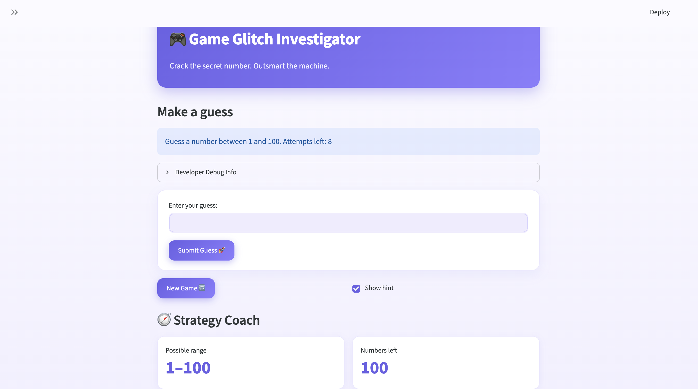

# 🎮 Game Glitch Investigator: The Impossible Guesser

## 🚨 The Situation

You asked an AI to build a simple "Number Guessing Game" using Streamlit.
It wrote the code, ran away, and now the game is unplayable. 

- You can't win.
- The hints lie to you.
- The secret number seems to have commitment issues.

## 🛠️ Setup

1. Install dependencies: `pip install -r requirements.txt`
2. Run the broken app: `python -m streamlit run app.py`

## 🕵️‍♂️ Your Mission

1. **Play the game.** Open the "Developer Debug Info" tab in the app to see the secret number. Try to win.
2. **Find the State Bug.** Why does the secret number change every time you click "Submit"? Ask ChatGPT: *"How do I keep a variable from resetting in Streamlit when I click a button?"*

You store the variable and keep it from resetting by using session state. Streamlit reruns the script after every interaction. Use st.session_state to store information that must survive reruns.

3. **Fix the Logic.** The hints ("Higher/Lower") are wrong. Fix them.
4. **Refactor & Test.** - Move the logic into `logic_utils.py`.
   - Run `pytest` in your terminal.
   - Keep fixing until all tests pass!

## 📝 Document Your Experience

- [ ] Describe the game's purpose. 
   **The purpose of the game is to guess a secret number between a set range of values (determined by the games overall difficulty setting.)**
- [ ] Detail which bugs you found.
**I mostly found bugs within the logic of the game.**
- [ ] Explain what fixes you applied.
**I applied fixes that enhances the logic, quality, and gaming experience for a "Guess the Number" game. 
## 📸 Demo Walkthrough

Describe your fixed game in numbered steps so a reader can follow along without watching a video:

1. User enters a guess of 50
2. The game returns a hint that's either "Too Low" or "Too High" depending on the secret
3. User enters a guess of 25; the game returns "Too Low" or "Too High" depending on the secret
4. Score and attempts update after each guess
5. Game ends after the correct guess or when out of attempts

**Screenshot:**



## 🧪 Test Results

```
# ========================== test session starts ===========================
platform darwin -- Python 3.14.5, pytest-9.0.3, pluggy-1.6.0
rootdir: /Users/kylemitchell/ai110-module1show-gameglitchinvestigator-starter
plugins: anyio-4.13.0
collected 43 items

tests/test_game_logic.py ............................................ [100%]

=========================== 43 passed in 2.21s ===========================
```

## 🚀 Stretch Features

### 🎨 Enhanced UI (Challenge 4)

The game was redesigned from the stock Streamlit look into a polished,
web-game-quality interface built around a **single, uniform indigo/violet
palette**. Every change is purely presentational — the 29-test suite (logic +
AppTest UI flows) still passes, so behavior is unchanged.

**Uniform palette**

| Role | Color |
|------|-------|
| Primary / accent (gradient) | `#6C5CE7` → `#8E7CFF` |
| Background | `#FBFAFF` → `#F3F0FF` |
| Cards / borders | `#FFFFFF` / `#ECE8FF` |
| Guess too **high** | `#FF6B6B` (coral) |
| Guess too **low** | `#4DABF7` (blue) |
| Winning guess | `#2ECC71` (green) |

**What changed**

- **Themed foundation** — a custom [`.streamlit/config.toml`](.streamlit/config.toml)
  sets the base colors so every built-in widget matches the palette out of the
  box.
- **Custom CSS layer** ([`style.css`](style.css), loaded by the app) — rounded
  "card" containers, gradient buttons with hover lift, restyled metrics, a
  gradient progress bar, softened alert boxes, themed sidebar, and the default
  Streamlit menu/footer hidden for a cleaner, app-like frame.
- **Gradient hero header** replacing the plain title, with a tagline.
- **Wordle-style guess chips** — every past guess appears as a colored pill
  (red = too high, blue = too low, green = the winning guess), giving instant
  visual feedback on your guessing trail.
- **Restyled Strategy Coach** — the live range/“numbers left” metrics and the
  search-space progress bar now read as polished cards in the same palette.

**Where it lives**

- [`.streamlit/config.toml`](.streamlit/config.toml) — theme/palette base
- [`style.css`](style.css) — the full custom UI layer
- [`app.py`](app.py) — loads the CSS, renders the hero, guess chips, and footer

**Screenshot:**


