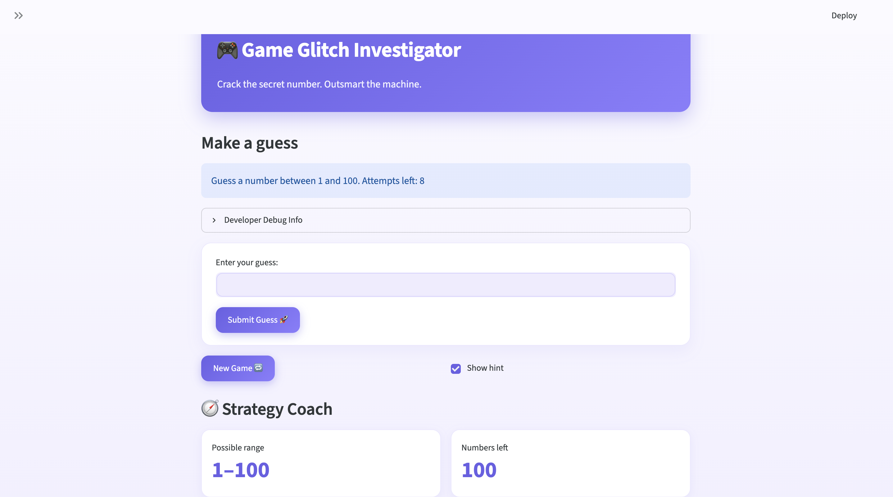

# Game Glitch Investigator

A number-guessing game built with Python and Streamlit. I extended a buggy CodePath starter into a playable game with consistent hints, difficulty settings, scoring, input validation, a redesigned interface, and a Strategy Coach.



## What I changed

- Fixed game state that reset between Streamlit reruns, reversed higher/lower hints, and incomplete New Game resets.
- Moved game rules into `logic_utils.py` so they can be tested independently of the interface.
- Added regression tests for the original bugs and edge cases, including invalid and duplicate guesses, difficulty changes, and the coach's range calculations.
- Added an optional Strategy Coach showing the numbers still possible, the share of the search space ruled out, and a suggested midpoint guess.
- Redesigned the interface with a consistent color palette and a visual history of guesses.

The Strategy Coach uses deterministic binary-search logic; it does not call an AI model at runtime. I used AI assistance during development, reviewed the suggestions, and documented mistakes I corrected in [`ai_interactions.md`](ai_interactions.md). The debugging process is described in [`reflection.md`](reflection.md).

## Run locally

Python 3.10 or newer is required.

```bash
python3 -m venv .venv
source .venv/bin/activate
python -m pip install -r requirements.txt
python -m streamlit run app.py
```

Choose a difficulty, enter an integer in the displayed range, and use the hints to find the secret before your attempts run out. Invalid and repeated guesses do not use an attempt. The Strategy Coach is on by default; its suggested next guess is optional.

## Test

```bash
python -m pytest -q
```

The suite includes pure game-logic tests and Streamlit `AppTest` interface-flow tests. Run it in your own environment to see the current result; this README does not rely on a copied test count from an earlier run.

## Project origin

This project began with [CodePath's AI110 Game Glitch Investigator starter](https://github.com/codepath/ai110-module1show-gameglitchinvestigator-starter). The original exercise provided the broken game and debugging brief. The fixes, Strategy Coach, tests, and interface changes in this fork document my extension of that starter.


